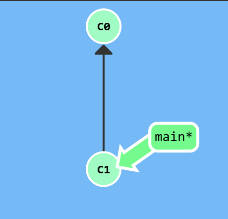
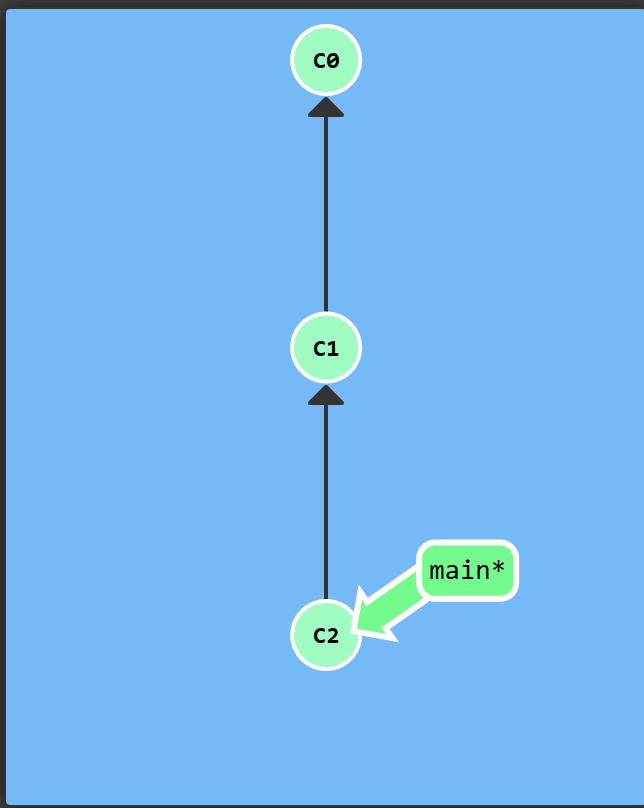
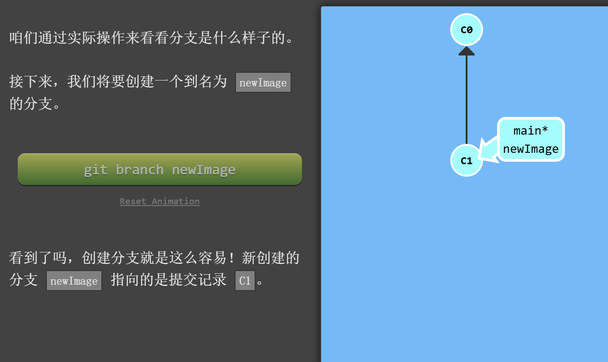
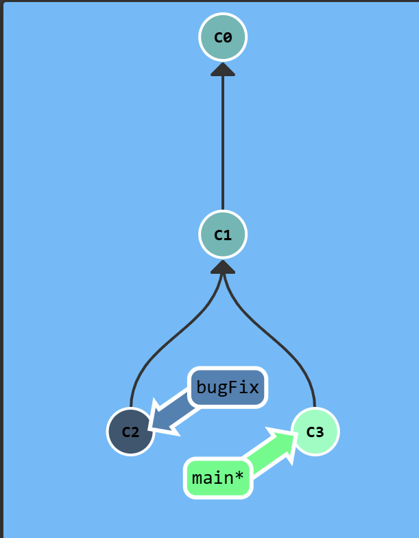
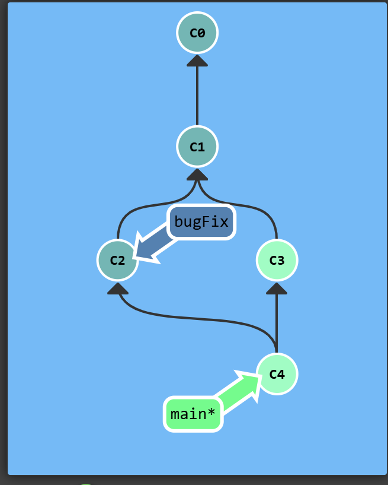
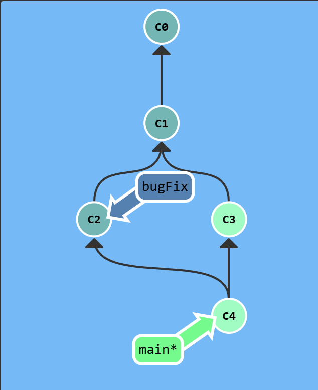
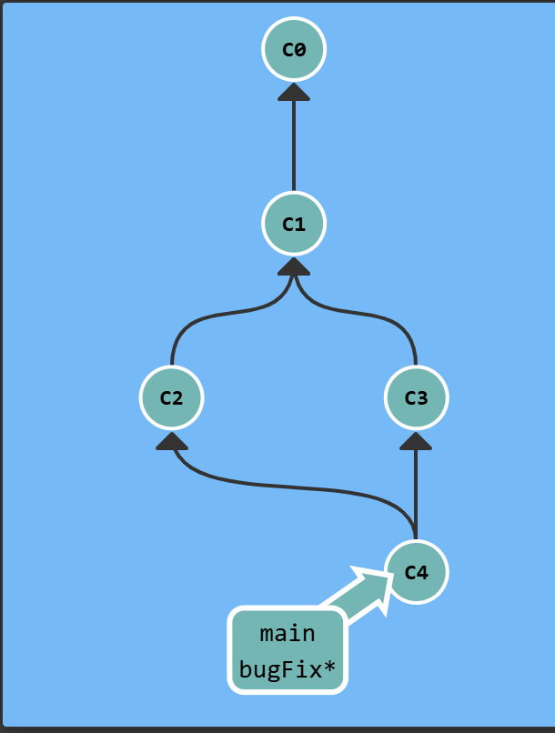

# 
git操作  
learn git branch是一个闯关式学习git的项目  
https://learngitbranching.js.org/?locale=zh_CN  
# Git Commit
顾名思义就是提交的意思  
c0>>>c1
  

<b><i>它会将当前版本与仓库中的上一个版本进行对比，并把所有的差异打包到一起作为一个提交记录</i></b>

# Git Branch  
建一个分支，指向一个提交 
  
但这里还没有切换分支，所以还在main  
# Git Checkout "your-branch-name"
切换分支
# Git Checkout -b "your-branch-name"
两步变一步，新建分支然后切换过去  

# Git Merge  
  
 
快速合并：切换到bugFix,再merge。这是因为
***当前bugfix是main的直接祖先***（指的是它们指向的commit）  

